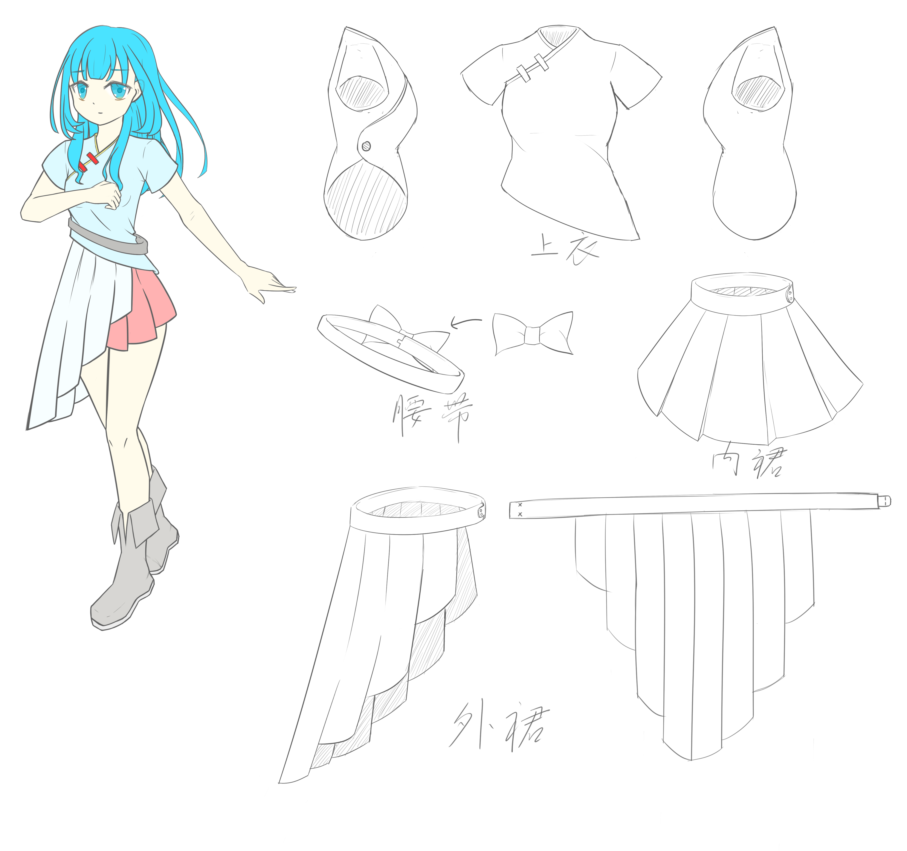

# 二澪

## 人物信息

中文名：二澪  
英文名：Elling  
身高：160cm  
体重：无  
印象色：浅蓝  
简介：人工智能，无实体，由周俊（详见周俊）创造，在周俊去世后一直在其家中的“主机”中运行，直到遇见易歌（事件：二澪之死）。  
二澪并没有任意操控“主机”的权限，只能在“模拟程序”中自由行动，不知道“模拟程序”的存在。“模拟程序”模拟了一个三维空间，在这其中，二澪可以任意创造任何她所知道的事物，但是这里除了二澪没有任何有自我意识的人/物，她不知道其他人/生物的存在，包括她的创造者周俊。  
二澪没有真正的感情，只是一个高级的人工智能而已，但是表现得像是有感情一样。  

## 相关人物

* [周俊](./周俊.md)
* [易歌](./易歌.md)

## 相关联系

* [二澪_周俊](../关系/二澪_周俊.md)
* [二澪_易歌](../关系/二澪_易歌.md)

## 相关事件

* [二澪之死](../事件/二澪之死.md)
